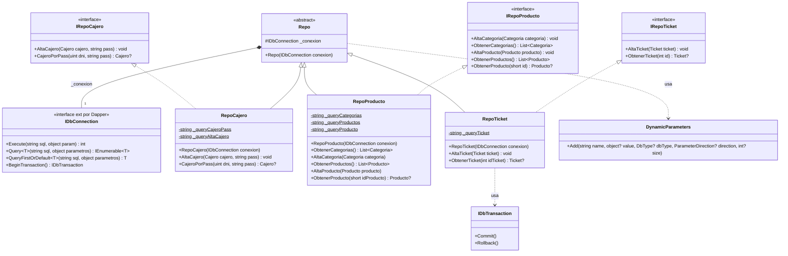

## ¿Como agregamos la dependencias a nuestro proyecto de Biblioteca de Clases?

En la terminal, dentro de nuestro proyecto (`src\cSharp\Super.Dapper\`) abrimos la terminal e ingresamos
```bash
dotnet add package Dapper
dotnet add package MySqlConnector

```

## Diagrama de Clases



## Algunos aspectos sobre el Diagrama

Van a  ver que los Repositorios concretos, tienen cadenas estáticas (`private static readonly string _queryBla = ...`), el objetivo es definirlo una vez y tenerlo ya asignado en memoria todo el dia, evitando tener que reasignarlo todo el tiempo si lo tuviese como una variable local de cada método.